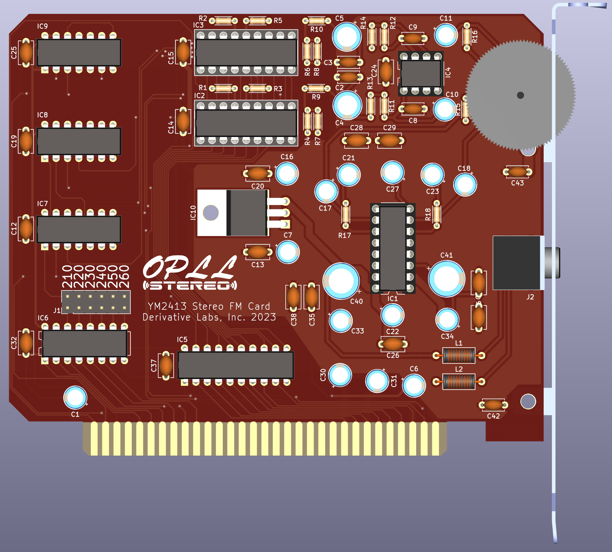

# OPLL Stereo ISA Sound Card

 
## What is this?

It's an ISA sound card that uses two YM2413s (otherwise known as the OPLL) in stereo to make noise.

## Okay, but why?

I don't know, you tell me. You're the one looking at this repository.

## What can I do with it?

Whatever you want, I'm not your dad.

## Okay, but I mean, what software can I run with it?

If you're asking what software supports it, the answer is "none."

## Then I ask again: why?

Because there weren't enough weird sound cards for the PC, apparently.

## How do I program it?

The jumper block lets you select a base address from 210h, 220h, 230h, 240h, 250h, or 260h. Assuming you have the base address set at 210h, the left channel OPLL lives on 210h-201h, and the right channel OPLL lives on 212h-213h. Write to the first address for a chip to select a register in the OPLL, and write to the second address to write data to that register.

That's it. That's the card.

## Okay, but how do I program the OPLL?

I actually have no idea. You'll want to refer to the datasheet, which is in this repository as "YM2413 Datasheet.pdf". Pages 4 and 5 contain the register map, and register data. In short, the OPLL is a cut-rate OPL that was originally intended for cheap-ass pachinko machines and other things that make annoying noises at you to get your attention. I think it also does Teletext, if that floats your boat for some reason. It supports up to nine voices, but only one of them is user-programmable. The rest you get to choose from a bunch of patches that live in ROM. Please let me know if you write anything interesting for this. I sure haven't yet.

## What if I just want to build one?

Now it's my turn to ask: why? Either way, OPLL-Stereo.zip is in the "gerbil" folder; you should be able to fire that off to JLCPCB and select "choose location" for the order number; the gerbers are all set up for that. The BOM is in a CSV file here with DigiKey links to the parts the board was designed for. If you find a 10K audio taper pot that fits that footprint, please let me know; I'm using a 50K with a 15K fixed resistor in parallel right now and it kind of sucks. Everything is pretty basic as far as parts go; a couple of the logic chips have been in shortage, but you should be able to substitute HCTs for the LSes if you need to, and everything should be actively available. The bracket is a Keystone 9202, and screws are listed. You'll need to drill a hole for the audio jack (I've been using a 9/32" bit) and cut a slot for a volume wheel, if you want to add one. There's a 3D-printable volume knob and card bracket in the `Mechanical` folder if you want to go that route. The volume knob attaches with an M1.4x0.3 5mm machine screw.

## I built one and it doesn't work! What the hell, man?

I'm not surprised.
